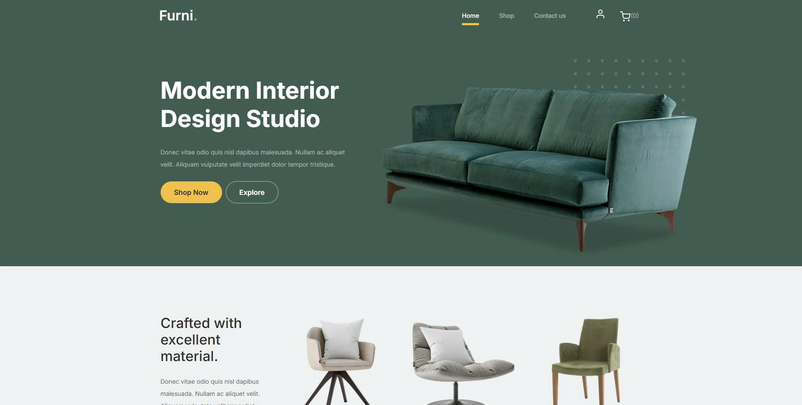
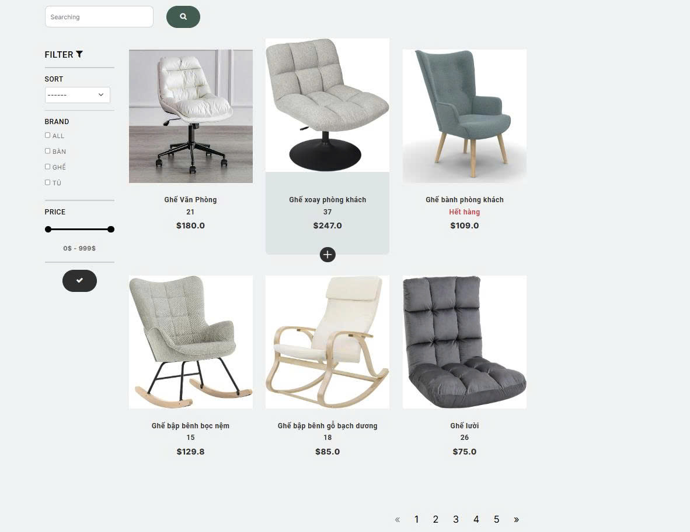
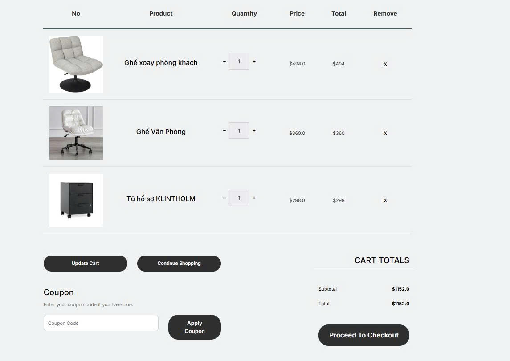
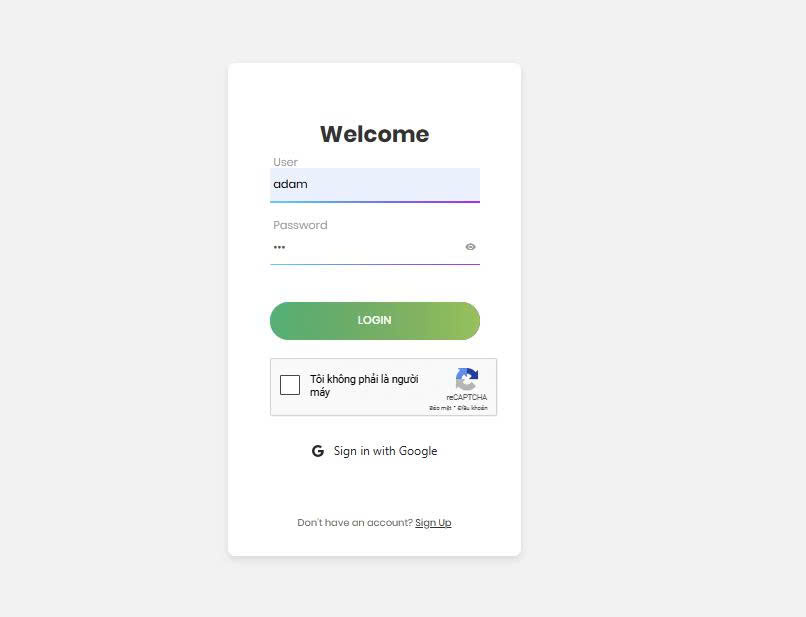

# Furni Store

**Furni Store** is a modern e-commerce website specializing in high-quality furniture, making it easy for users to search, select, and purchase interior products for their living and working spaces.

## Key Features

- **Modern Homepage**: User-friendly interface with prominent product images and easy navigation.
- **Product Catalog**: Sort and filter products by type (table, chair, cabinet, etc.), brand, and price.
- **Smart Search**: Search for products by name or keyword.
- **Product Details**: Display detailed information, images, price, and stock status.
- **Shopping Cart**: Add, remove, and update product quantities in the cart.
- **User Authentication**: Support for traditional login/register and Google sign-in, secured with reCAPTCHA.
- **Checkout**: Multiple payment methods supported, including **VNPay** for secure online payments.
- **Pagination**: Easily browse through multiple products.
- **Responsive Design**: Works well on both desktop and mobile devices.

## Screenshots

### Homepage



### Product Catalog


### Cart Example


### Login Page


> **Note:** Replace the image paths above with the actual paths to your images in the repository.

## Technologies Used

- **Frontend**: HTML, CSS, JavaScript, Bootstrap
- **Backend**: Java Servlet, JSP
- **Database**: MySQL
- **Payment**: **VNPay** integration for online payments
- **Others**: reCAPTCHA, Google OAuth

## Installation

1. Clone the project:
   ```bash
   git clone https://github.com/yourusername/furni-store.git
   ```
2. Import into NetBeans/Eclipse/IntelliJ.
3. Configure the database in `web/WEB-INF/web.xml` or the corresponding config file.
4. Run the project on your server (Tomcat/Glassfish, etc.).
5. Access `http://localhost:8080/FurniWeb` to use the application.

## Contribution

For any contributions, suggestions, or bug reports, please use the [issue tracker](https://github.com/yourusername/furni-store/issues) or contact the development team directly.

---

## 📁 Dự án bao gồm các module:

```
src/
 └─ main/
     ├─ java/com/OLearning/
     │   ├─ config/               → Cấu hình Spring
     │   ├─ controller/           → Xử lý request, chia theo module
     │   ├─ entity/               → Các lớp ánh xạ DB (JPA Entity)
     │   ├─ exception/            → Xử lý ngoại lệ tùy chỉnh
     │   ├─ repository/           → Giao tiếp DB (Spring Data JPA)
     │   ├─ service/              → Business logic
     │   └─ OLearningApplication.java
     └─ resources/
         ├─ static/               → Tài nguyên tĩnh (JS, CSS, ảnh)
         ├─ templates/
         │    └─ adminDashboard/
         │         ├─ fragments/  → Giao diện tái sử dụng (header, footer, v.v.)
         │         └─ pages/      → Các trang chính (Gợi ý chia riêng)
         └─ application.properties
```

---

## 🧪 Hướng dẫn chạy dự án

1. **Yêu cầu:**
   - Java 21+
   - Maven
   - IDE (VS Code / IntelliJ)
   -  SQL Server

3. **Chạy app:**
   ```bash
   ./mvnw spring-boot:run
   ```